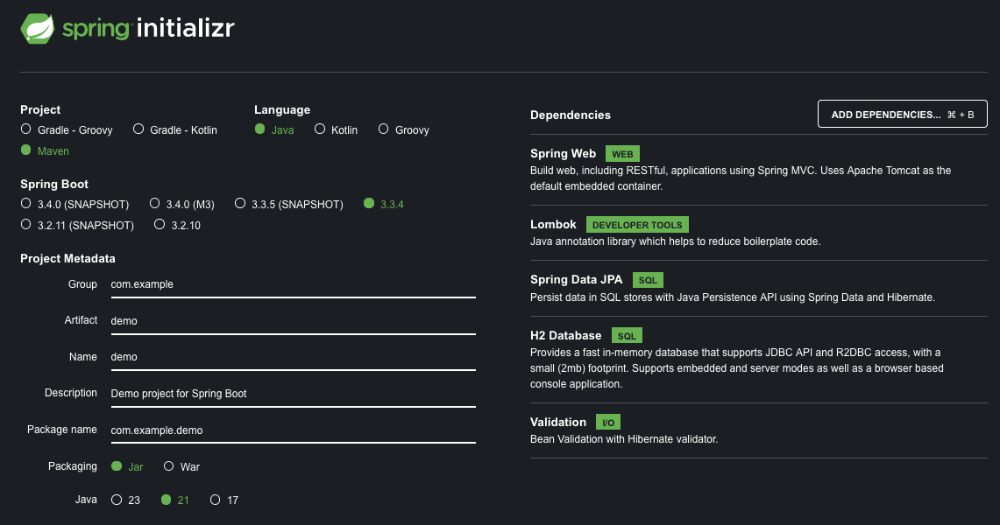

# Spring framework


## Generación de proyecto
Para arrancar un proyecto con spring, la forma más comoda es accediendo a su [web de inicializador](https://start.spring.io/).


### Metadatos
Contiene información esencial para la organización y construcción del proyecto. 
+ **Project**: Se puede elegir la herramienta de construcción Maven o Gradle. Dependiendo de la elección, se crearán los archivos de configuración.
+ **Language**: El framework tiene soporte para lenguajes que ejecutan en la Máquina Virtual de Java, siendo Java el lenguaje predilecto; para otros lenguajes existen frameworks especializados, por ejemplo, para el desarrollo de un backend con kotlin existe [ktor](https://ktor.io/).
+ **Spring boot**: Muestra las últimas versiones del framework. Aunque se habla de framework para hacer referencia a spring boot, este es una capa que otorga múltiples conjuntos de dependencias para simplificar su gestión.
+ **Project Metadata**: Solicita la información para generar la carpeta del proyecto, la paquetería y la versión de Java; En caso de decidir empaquetar como `Jar`, el framework añade un servidor embebido para que el proyecto se autohospede o puede elegir la opción de `War` para desplegarlo en un servidor de aplicaciones.

### Dependencias
Puede seleccionar los conjuntos de dependencias que le ayuden a construir el nuevo proyecto. Esta es una combinación habitual para levantar servicios web.
+ **Spring web**: Importa todo lo necesario para trabajar con peticiones HTTP.
+ **Lombok**: Esta librería agrega anotaciones que ayudan a reducir código repetitivo, como gettters, setters, constructores, etc.
+ **Spring Data JPA**: Importa el API de persistencia del core de java [JPA](https://es.wikipedia.org/wiki/Java_Persistence_API) y la librería hibernate, para desarrollar la capa de manipulación de datos.
+ **H2 Database**: añade el conector al motor de base de datos en memoria H2.
+ **Validation**: Agrega anotaciones adicionales para validaciones.

## Arquitectura
Spring sigue la arquitectura Modelo Vista Controlador [MVC]() y habilita un conjunto de anotaciones que sirven para su funcionamiento y tener una estructura semantica en los componentes del proyecto.

### Flujo de una petición
````mermaid
sequenceDiagram
    Cliente->>+UsuarioControlador: Petición http
    UsuarioControlador->>+UsuarioServicio: Valida la entrada y la transforma a entidad
    UsuarioServicio->>+UsuarioRepositorio: Solicita la información a la BBDD
    UsuarioRepositorio-->>-UsuarioServicio: Respuesta de la BBDD
    UsuarioServicio-->>-UsuarioControlador: Respuesta de BBDD
    UsuarioControlador-->>-Cliente: Transforma la respuesta y responde con un DTO
````